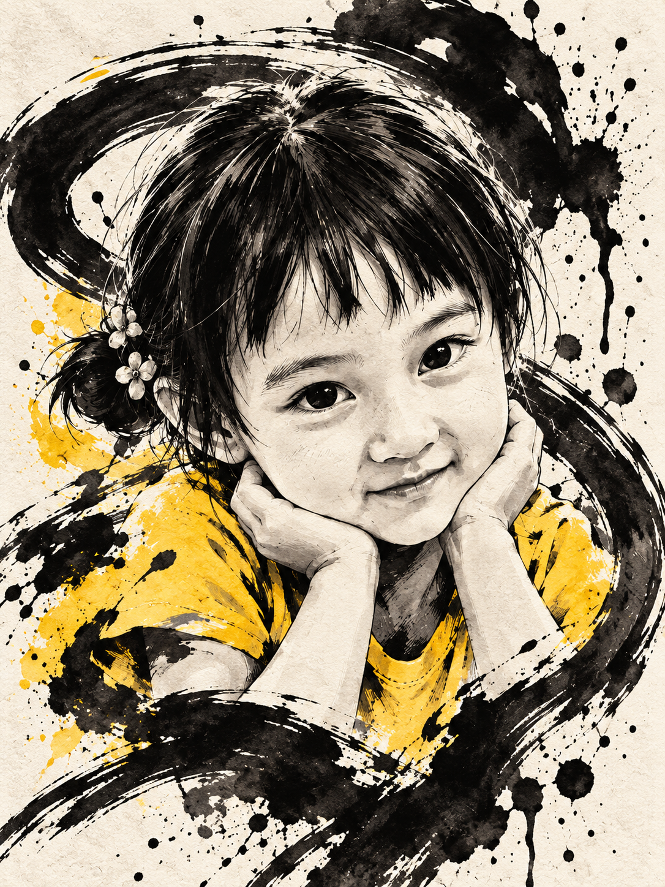

# jwan-ink-overrun-editorial-poster

Jwan black-ink boundary-breaking editorial poster Skill.

## Features

- Keep the original photograph in the upper half of a 3:4 poster.
- Rebuild the lower half as a minimal black-and-white ink illustration.
- Let a recognizable contour or object break the illustration boundary while retaining generous white space.

## Case

## Usage

Use `$jwan-ink-overrun-editorial-poster` followed by one photo. Add optional title, notes, or signature requirements.

## Repository structure

- `SKILL.md` — complete Skill definition
- `examples/` — generated case images
- `README.md` — usage and project notes
- `LICENSE` — MIT license

## License

Released under the MIT License. See `LICENSE`.
